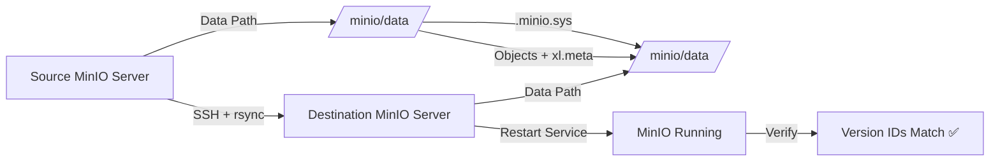
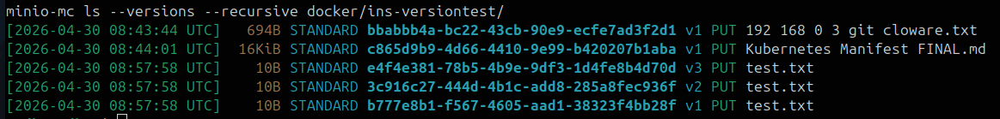

# 🚀 MinIO Zero-Loss Migration (DevOps Project)

A practical guide to migrate MinIO data between servers **without losing object version IDs**, using raw `rsync` — bypassing the MinIO API entirely.


> 🔥 Real-world DevOps solution for migrating MinIO while preserving version IDs — something API-level tools simply cannot do.

---

## 📖 Problem Statement

Standard MinIO migration (`mc mirror`) **breaks version history** by assigning new version IDs to every object.

This project demonstrates a **DevOps-safe migration approach** that ensures:

- ✅ Zero data loss
- ✅ Version ID preservation
- ✅ Metadata integrity
- ✅ Repeatable automation

---

## ⚠️ Important Limitations

> Read before proceeding.

- **Single-node MinIO only** — This approach works for standalone MinIO instances. Distributed/erasure-coded multi-node clusters require a different strategy (peer syncing, snapshot-based copy, etc.).
- **Planned downtime required** — Both source and destination MinIO services must be **stopped** during migration to ensure storage consistency. In-flight writes during rsync can cause partial or corrupted objects.
- **SSH key-based auth required** — Password-based SSH will interrupt the rsync process. Set up passwordless key auth before starting.

---

## 🧠 Solution Overview

We bypass MinIO API-level transfer and directly copy underlying storage using:

- `rsync` over SSH (with sudo elevation)
- Full `.minio.sys` metadata replication
- `xl.meta` preservation per object
- Controlled service downtime on both ends

---

## 🔧 Prerequisites

Before starting, ensure the following are in place:

| Requirement | Details |
|---|---|
| SSH key auth | Source → Destination (passwordless) |
| `rsync` installed | Both source and destination servers |
| `mc` (MinIO Client) | Installed and configured on both servers |
| Sudo privileges | Required on both servers for service control and file ops |
| MinIO as systemd service | Both servers managed via `systemctl` |
| Sufficient disk space | Destination must have ≥ source data size |

---

## 🏗️ Architecture



---

## ⚙️ Migration Steps

### 0️⃣ Pre-Migration: Backup Destination (Safety Net)

> **Always snapshot or backup your destination before proceeding.** If anything goes wrong, you can restore to a clean state.

```bash
# Optional: snapshot destination data directory before migration
sudo cp -a <DEST_DATA_PATH>/ <DEST_DATA_PATH>_backup/
```

---

### 1️⃣ Stop MinIO on **Both** Servers

Stopping only the destination is not enough. The source must also be stopped (or made read-only) to prevent partial writes during rsync.

```bash
# On SOURCE server
sudo systemctl stop minio

# On DESTINATION server
sudo systemctl stop minio
```

---

### 2️⃣ Run rsync (Core Step)

This copies all objects, `xl.meta` version metadata, and `.minio.sys` system metadata from source to destination.

```bash
sudo rsync -avz --progress \
  --rsync-path='sudo rsync' \
  <SOURCE_USER>@<SOURCE_HOST>:<SOURCE_DATA_PATH>/ \
  <DEST_DATA_PATH>/
```

**Flag notes:**
- `-a` — Archive mode: preserves permissions, timestamps, symlinks
- `-v` — Verbose output
- `-z` — Compress data during transfer
- `--progress` — Show per-file progress
- `--rsync-path='sudo rsync'` — Elevates rsync on the remote (source) side

> ⚠️ **Do NOT use `--delete`** unless you fully intend to remove objects on the destination that don't exist on the source. Accidental deletion of `.minio.sys` or version metadata will corrupt the bucket.

> 💡 For large datasets or unreliable networks, add `--checksum` to compare files by content rather than timestamps — slower but more reliable.

---

### 3️⃣ Fix Permissions

After rsync, files are owned by the SSH user. Reset ownership to the MinIO service user.

```bash
sudo chown -R <DEST_SERVICE_USER>:<DEST_SERVICE_USER> <DEST_DATA_PATH>/
```

---

### 4️⃣ Start MinIO on Destination

```bash
sudo systemctl start minio
```

Check service health:

```bash
sudo systemctl status minio
```

---

### 5️⃣ Start MinIO on Source

```bash
# On SOURCE server — bring it back online
sudo systemctl start minio
```

---

## ✅ Verification

Use `mc` (MinIO Client) to verify version IDs match exactly between source and destination.

> **Note:** The MinIO Client binary may be installed as `mc` or `mcli` depending on your system. Use whichever applies.

```bash
# Check versions on source
mc ls --versions <SOURCE_ALIAS>/<BUCKET>/<OBJECT>

# Check versions on destination
mc ls --versions <DEST_ALIAS>/<BUCKET>/<OBJECT>
```

✔ Version IDs must match exactly across both outputs.

---

## 📸 Proof of Version Preservation

### 🔹 Source


### 🔹 Destination


---

## 🔍 Example Comparison

| Version | Source ID | Destination ID | Match |
|---------|-----------|----------------|-------|
| v1 | b777e8b1-f567-4605-aad1-38323f4bb28f | b777e8b1-f567-4605-aad1-38323f4bb28f | ✅ |
| v2 | 3c916c27-444d-4b1c-add8-285a8fec936f | 3c916c27-444d-4b1c-add8-285a8fec936f | ✅ |
| v3 | e4f4e381-78b5-4b9e-9df3-1d4fe8b4d70d | e4f4e381-78b5-4b9e-9df3-1d4fe8b4d70d | ✅ |

✔ Version IDs match exactly → Migration successful

---

## 🧠 Why This Works

MinIO stores all data and metadata at the **filesystem layer**, not just in an API layer.

| Location | Contains |
|---|---|
| `<data_path>/<bucket>/<object>/` | Object data chunks |
| `xl.meta` (per object) | Version IDs, checksums, creation timestamps |
| `.minio.sys/` | Bucket policies, IAM, erasure config |

**`mc mirror` / API-level copy:**
- Uploads objects as new PUT requests → MinIO generates **new version IDs** ❌

**`rsync` raw copy:**
- Copies the underlying filesystem byte-for-byte → `xl.meta` arrives intact → **same version IDs** ✅

This is why no API-based tool (mc mirror, rclone, AWS S3 sync) can preserve MinIO version IDs — they all go through the object API which always generates new IDs on ingest.

---

## 🧯 Rollback Plan

If the migration fails or the destination is unhealthy after starting MinIO:

1. Stop MinIO on destination: `sudo systemctl stop minio`
2. Restore from backup: `sudo rm -rf <DEST_DATA_PATH>/ && sudo mv <DEST_DATA_PATH>_backup/ <DEST_DATA_PATH>/`
3. Fix permissions: `sudo chown -R <DEST_SERVICE_USER>:<DEST_SERVICE_USER> <DEST_DATA_PATH>/`
4. Start MinIO: `sudo systemctl start minio`

---

## 📜 License

MIT
