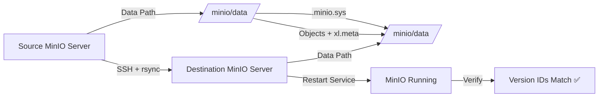

# 🚀 MinIO Zero-Loss Migration (DevOps Project)

A practical guide to migrate MinIO data between servers without losing object version IDs, using raw rsync.


> 🔥 Real-world DevOps solution for migrating MinIO while preserving version IDs (not possible with API tools)

---

## 📖 Problem Statement

Standard MinIO migration (`mc mirror`) **breaks version history** by assigning new version IDs.

This project demonstrates a **DevOps-safe migration approach** that ensures:
- ✅ Zero data loss  
- ✅ Version ID preservation  
- ✅ Metadata integrity  
- ✅ Repeatable automation  

---

## 🧠 Solution Overview

We bypass MinIO API-level transfer and directly copy underlying storage using:

- `rsync` (with sudo over SSH)
- Full `.minio.sys` metadata replication
- Controlled service downtime

---

## 📸 Proof of Version Preservation

### 🔹 Source


---

### 🔹 Destination


---

## 🔍 Example Comparison

| Version | Source ID | Destination ID |
|--------|----------|----------------|
| v1 | b777e8b1-f567-4605-aad1-38323f4bb28f | b777e8b1-f567-4605-aad1-38323f4bb28f |
| v2 | 3c916c27-444d-4b1c-add8-285a8fec936f | 3c916c27-444d-4b1c-add8-285a8fec936f |
| v3 | e4f4e381-78b5-4b9e-9df3-1d4fe8b4d70d | e4f4e381-78b5-4b9e-9df3-1d4fe8b4d70d |

✔ Version IDs match exactly → Migration successful

---

## 🏗️ Architecture



---

## ⚙️ Migration Steps

### 1️⃣ Stop Destination MinIO

```bash
sudo systemctl stop minio
```

---

### 2️⃣ Run rsync (Core Step)

```bash
sudo rsync -avz --progress \
  --rsync-path='sudo rsync' \
  <SOURCE_USER>@<SOURCE_HOST>:<SOURCE_DATA_PATH>/ \
  <DEST_DATA_PATH>/
```

---

### 3️⃣ Fix Permissions

```bash
sudo chown -R <DEST_SERVICE_USER>:<DEST_SERVICE_USER> <DEST_DATA_PATH>/
```

---

### 4️⃣ Start MinIO

```bash
sudo systemctl start minio
```

---

## ✅ Verification

```bash
minio-mc ls --versions <SOURCE_ALIAS>/<BUCKET>/<OBJECT>
minio-mc ls --versions <DEST_ALIAS>/<BUCKET>/<OBJECT>
```

✔ Version IDs must match

---

## 🧠 Why This Works

MinIO stores metadata at the storage layer:

- Object data → bucket directories  
- Version metadata → `xl.meta`  
- System metadata → `.minio.sys`  

`mc mirror`:
- Recreates objects → new version IDs ❌  

`rsync`:
- Copies raw storage → preserves metadata → same IDs ✅  

---

## 📜 License

MIT
